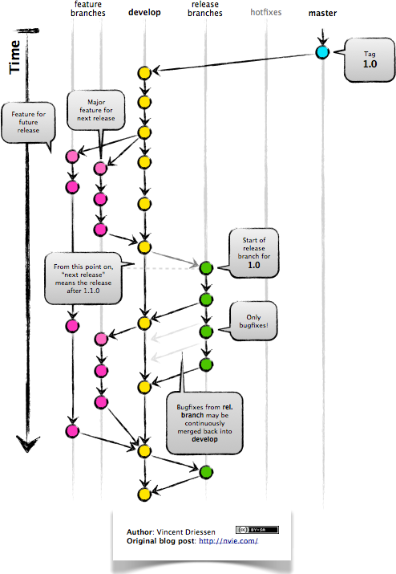

[]()

<p align="center">
  
</p>


This is the official repository of HYPED. HYPED is a student society at the University of Edinburgh dedicated to accelerating the development of Hyperloop and implementing the technology in the UK. HYPED is advancing both technical and commercial development of Hyperloop, having seen success in two international competitions. https://hyp-ed.com/

# Contributing

The following is a set of guidelines for contributing to HYPED. These are mostly guidelines, not rules. Use your best judgment, and feel free to propose changes to this document in a pull request.

## Coding Style
 Since we will have dozens of developers coding for the pod, it is very important that everyone adheres to the same code style. For that purpose we have created the following [style guide](https://hyp-ed.github.io/styleguide/).

## Git

Git is a prerequisite for this project. If you have not attended any git workshop yet or are not permitted to code, please ask Brano for further instructions.
### Workflow
For our project we are using the [Gitflow](http://nvie.com/posts/a-successful-git-branching-model/) workflow. Instead of a single master branch, this workflow uses two branches to record the history of the project. The master branch stores the official release history, and the develop branch serves as an integration branch for features. Each new feature should reside in its own branch, which can be pushed to the central repository for backup/collaboration. But, instead of branching off of master, feature branches use develop as their parent branch. When a feature is complete, it gets merged back into develop. Features should never interact directly with master.

<p align="center">
  
</p>


### Rules

* Perform work in a feature branch.
    
    _Why:_
    >Because this way all work is done in isolation on a dedicated branch rather than the main branch. It allows you to submit multiple pull requests without confusion. You can iterate without polluting the master branch with potentially unstable, unfinished code. [Read more...](https://www.atlassian.com/git/tutorials/comparing-workflows#feature-branch-workflow)
* Branch out from `develop`
    
    _Why:_
    >This way, you can make sure that code in master will almost always build without problems.

* Never push into `develop` or `master` branch. Make a pull request.
    
    _Why:_
    > It notifies team members that they have completed a feature. It also enables easy reviews of the code.

* Update your local `develop` branch and do a rebase before pushing your feature and making a pull request.

    _Why:_
    > Rebasing will merge in the requested branch (`master` or `develop`) and apply the commits that you have made locally to the top of the history without creating a merge commit (assuming there were no conflicts). Resulting in a nice and clean history. [Read more ...](https://www.atlassian.com/git/tutorials/merging-vs-rebasing)

* Resolve potential conflicts while rebasing and before making a pull request.
* Delete local and remote feature branches after merging.
    
    _Why:_
    > It will clutter up your list of branches with dead branches. It insures you only ever merge the branch back into (`master` or `develop`) once. Feature branches should only exist while the work is still in progress.

* Before making a pull request, make sure your feature branch builds successfully and passes all tests (including code style checks).
    
    _Why:_
    > You are about to add your code to a stable branch. If your feature-branch tests fail, there is a high chance that your destination branch build will fail too. Additionally, you need to apply code style check before making a pull request. It aids readability and reduces the chance of formatting fixes being mingled in with actual changes.

* Protect your `develop` and `master` branch.
  
    _Why:_
    > It protects your production-ready branches from receiving unexpected and irreversible changes. Read more on [Github](https://help.github.com/articles/about-protected-branches/) and [Bitbucket](https://confluence.atlassian.com/bitbucketserver/using-branch-permissions-776639807.html)
    
* Write good commit messages. Write in imperative mood style and capitalise the messages.
    
    ## Getting started
    
* Checkout a new feature branch. The prefix of the branch should be the standard abbreviation of your subteam (nav, state, etc.)
    ```sh
    git checkout -b <subteam_feature>
    ```
* Make changes.
    ```sh
    git add
    git commit -m "commit"
    ```

* Sync with remote to get changes you have missed.
    ```sh
    git checkout develop
    git pull
    ```
    
    _Why:_
    > This will give you a chance to deal with conflicts on your machine while rebasing (later) rather than creating a pull request that contains conflicts.
    
* Update your feature branch with latest changes from develop with rebase or interactive rebase.
    ```sh
    git checkout <subteam_feature>
    git rebase -i --autosquash develop
    ```
    
    _Why:_
    > You can use --autosquash to squash all your commits to a single commit. Nobody wants many commits for a single feature in develop branch. [Read more...](https://robots.thoughtbot.com/autosquashing-git-commits)
    
* If you do not have any conflicts skip this step. If you have conflicts, [resolve them](https://help.github.com/articles/resolving-a-merge-conflict-using-the-command-line/) and continue rebase.
    ```sh
    git add <file1> <file2> ...
    git rebase --continue
    ```
* Push your branch. Rebase will change history, so you'll have to use `-f` to force changes into the remote branch. If someone else is working on your branch, use the less destructive `--force-with-lease`.
    ```sh
    git push -f
    ```
    
    _Why:_
    > When you do a rebase, you are changing the history on your feature branch. As a result, Git will reject normal `git push`. Instead, you'll need to use the -f or --force flag. [Read more...](https://developer.atlassian.com/blog/2015/04/force-with-lease/)
    
    
* Make a pull request.
* Pull requests will be accepted, merged and closed by a reviewer.
* Remove your local feature branch if you are done.

  ```sh
  git branch -d <subteam_feature>
  ```
* To remove all branches which are no longer on remote
  ```sh
  git fetch -p && for branch in `git branch -vv | grep ': gone]' | awk '{print $1}'`; do git branch -D $branch; done
  ```
